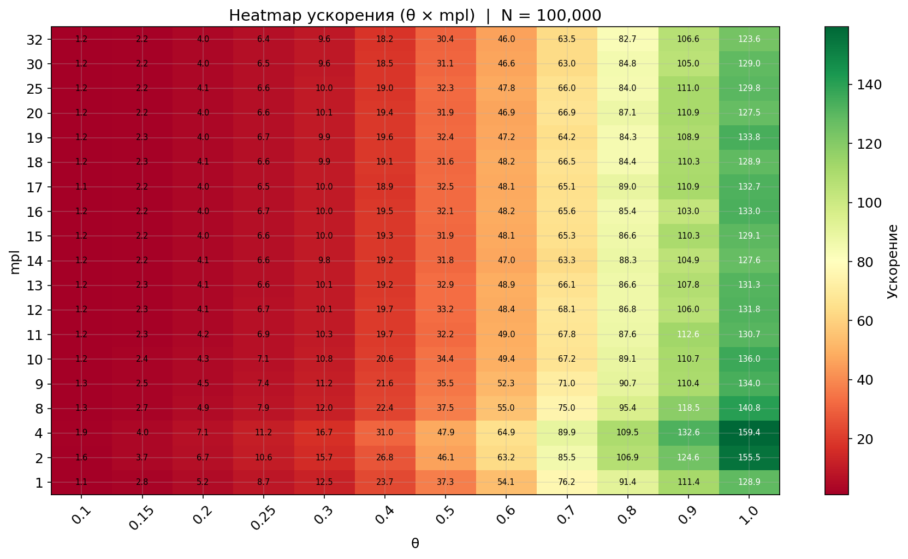
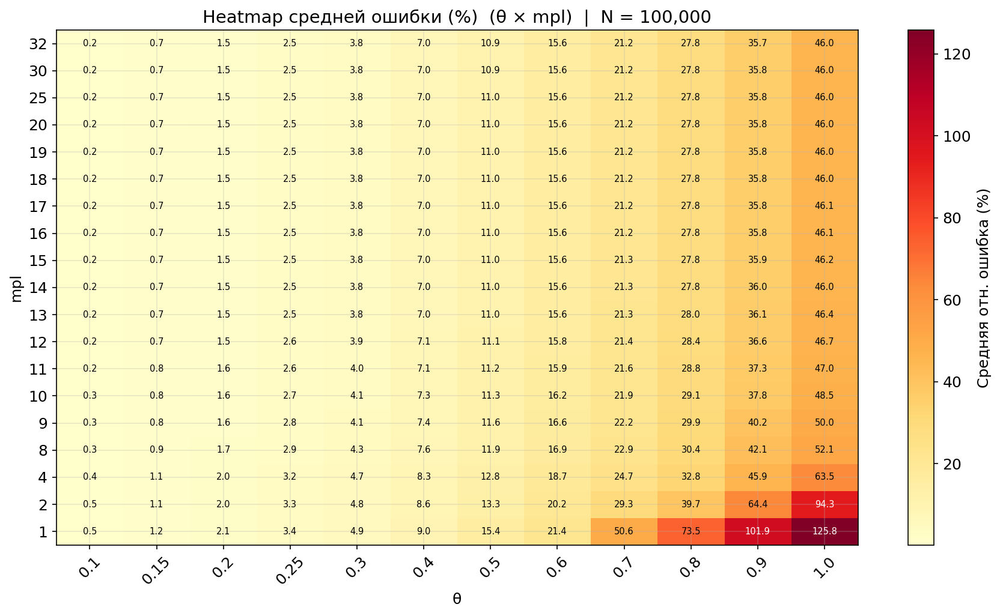

# DEM — Discrete Element Method

Ядро дискретно-элементного моделирования: каждая капля — отдельная
частица с координатой, радиусом и силой. Используется
[Taichi](https://www.taichi-lang.org/) для параллельных вычислений
на CPU/GPU.

## Что делает DEM

1. **Генерирует** начальное распределение капель (`particle_generator/`).
2. **Считает силы** между всеми парами капель (`force_calculator/`,
   `octree/`).
3. **Обнаруживает столкновения** за O(N) (`collision_detector/`).
4. **Интегрирует** уравнения движения методом Эйлера (`solver/`).
5. **Хранит траектории** и состояния (`solution/`, `particle_state/`).
6. **Учитывает периодику** через MIC + COMSOL-поправку
   (`periodic_correction/`).
7. **Визуализирует и пост-обрабатывает** (`post_processor/`).

Полные формулы и численные схемы — [`../ALGORITHM.md`](../ALGORITHM.md).

---

## Структура

```
dem/
├── collision_detector/     # Spatial-hash O(N) детектор столкновений
├── force_calculator/       # Direct O(N²) попарный расчёт сил
├── octree/                 # Flat Barnes-Hut octree O(N log N)
├── particle_generator/     # Генерация начальных условий
├── particle_state/         # Снапшот состояния системы
├── periodic_correction/    # Псевдо-периодическая поправка из COMSOL
├── post_processor/         # 3D-визуализация, анимации
├── solution/               # Хранение траекторий
├── solver/                 # Эйлер-интегратор
├── statistics/             # Сбор статистики direct vs tree
└── utils/                  # Утилиты (MIC, расстояния)
```

Каждая поддиректория содержит собственный `README.md` с описанием
интерфейса и примеров.

---

## Поток данных

```
ParticleGenerator
       │
       ▼
 DropletState ────────────┐
       │                  │
       ▼                  ▼
 ForceCalculator    CollisionDetector
       │                  │
       └────────┬─────────┘
                ▼
            Solver (Euler)
                │
                ▼
          DropletSolution ──► PostProcessor
```

`PeriodicCorrection` подключается к `ForceCalculator` для добавки
к стоксовскому полю скоростей. `Statistics` собирает метрики при запуске
direct/tree-вариантов через `dem/statistics/`.

---

## Минимальный пример

```python
import taichi as ti
ti.init(arch=ti.cpu, default_fp=ti.f64)

from dem.particle_generator import UniformDropletGenerator
from dem.force_calculator import DirectDropletForceCalculator
from dem.collision_detector import SpatialHashCollisionDetector
from dem.solution import DropletSolution
from dem.solver import EulerDropletSolver
from dem.post_processor import DropletPostProcessor

box = 1e-3
state = UniformDropletGenerator(
    coord_range=(0, box),
    radii_range=(2.5e-6, 7.5e-6),
    num_particles=500,
).generate()

fc  = DirectDropletForceCalculator(num_particles=500, L=box, boundary_mode="periodic")
cd  = SpatialHashCollisionDetector(num_particles=500, L=box, boundary_mode="periodic")
sol = DropletSolution(initial_droplet_state=state)
pp  = DropletPostProcessor(sol, box_size=box)

EulerDropletSolver(fc, sol, pp, collision_detector=cd).solve(dt=0.04, t_stop=10)
```

Аналогичные примеры с tree-методом — `main_tree.py`, со связкой PBM —
`main_coupled.py`.

---

## Производительность

<p align="center">
  
  <br>
  <em>Тепловая карта ускорения</em>
</p>
<p align="center">
  <!-- Замените на имя вашего второго графика -->
  
  <br>
  <em>Тепловая карта ошибок</em>
</p>

Вычислительные эксперименты проведены на системе:
- **CPU**: Intel Core i7-11800H (16 потоков, 4.60 GHz)
- **RAM**: 32 ГБ
- **Ядро**: Linux 7.0.3-zen1-2-zen

Бенчмарки — [`../benchmarks/README.md`](../benchmarks/README.md).

---

## Связанные документы

- [ALGORITHM.md](../ALGORITHM.md) — полный алгоритм и формулы.
- [pbm/README.md](../pbm/README.md) — связка с Population Balance Model.
- [tests/README.md](../tests/README.md) — тестовое покрытие.

---

## Автор и контакты

**Dadakhodjaev Rustam Bakhtiyorovich**
[rustam.dadakhodjaev@gmail.com](mailto:rustam.dadakhodjaev@gmail.com) ·
[st094266@student.spbu.ru](mailto:st094266@student.spbu.ru) ·
Telegram: [@ddkx21](https://t.me/ddkx21)

Лицензия: [MIT](../LICENSE) — см. корневой [README](../README.md).
